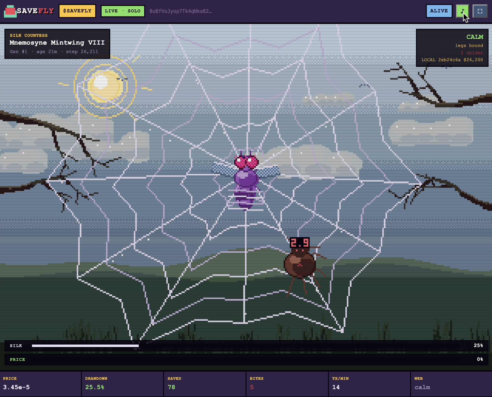
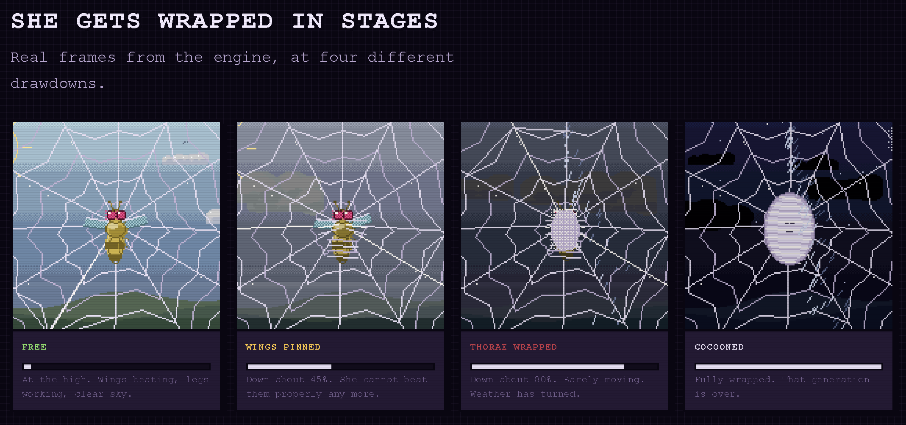
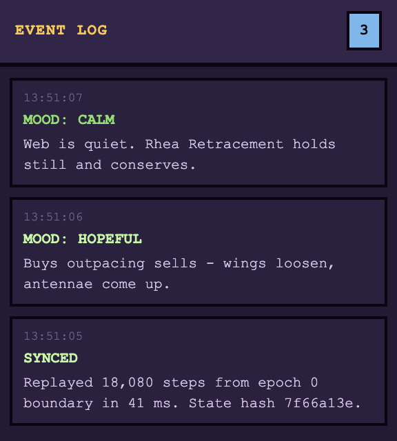

# SaveFly

A pixel fly caught in a web, whose state is driven by the real stream of
on-chain trades. Sells spawn spiders, buys spawn shots that knock them down.
The silk on the fly is the price drawdown from the all-time high plus a debt
for the spiders that got through. A fully wrapped fly dies, and the next
generation hatches from the cocoon.

Render is 320×224, fixed palette, the browser does the upscaling.



# Save Fly Narrative

On September 3, 2026, researchers published the complete connectome of a male fruit fly - a map of more than 166,000 neurons and millions of neural connections. For the first time, the wiring of an entire fly nervous system could be studied as a complete system.

**SaveFly turns that wiring into a living digital creature.**

The fly you see is built from the neural architecture of a real fly.

Her behavior comes from the wiring of a real fly brain - the same neural architecture that lets a real fly sense, react and move through the world.

And now she is trapped.

Her survival is tied to the market.

Every buy gives her a chance.
Every sell brings the spiders closer.
Every drawdown tightens the silk.

The holders decide what happens next.

Save her, and the fly lives.

Let her get wrapped, and the next generation hatches from the cocoon.

This isn't just an animation.

It is a digital fly built from a real biological connectome, living inside a market that never stops moving.

**Real fly. Real neural wiring. Real trades. One digital life.**

**SAVE FLY.**



## The Game Lives on Robinhood Chain

SaveFly isn't a web game that happens to read blockchain data.

**Her entire life is derived from on-chain activity.**

Buys, sells, prices, blocks and transaction hashes are read from Robinhood Chain and become the canonical event stream of the simulation. Nothing in her state is invented: feed the same event log into the engine and you get the same fly, down to the bit.

The code is open, and the picture it produces is reproducible by anyone with `tools/replay.js`.

There is no fake market feed behind the fly.

There is no hidden server deciding what you see.

**The code lives on-chain.
The market lives on-chain.
The fly lives in it.**

What happens to her is determined by what happens on-chain.

The blockchain isn't just where the token lives.

**It is the environment she lives in.**

## The key property

The state is derived **exclusively** from `(GENESIS_SEED, ordered event log,
step number)`. There is no `Math.random` in the simulation and no dependence
on frame rate. That is why every viewer sees the same fly.

You can check it by eye: the state hash sits in the top right corner, e.g.
`SYNC 6a6853ff @23320`. Two windows side by side show the same string.



## Quick start

```bash
npm install            # only needed for tests (canvas)
node tools/serve.js    # http://localhost:8080
```

Without a config the game runs its built-in generator: badge `simulated`,
`SIM` in the corner. This is for local development only - do not ship it
like that as the token page.

## Modes

Set in `src/savefly.config.json`, no need to edit the HTML:

| Mode          | Data source                        | Shared state             | What you need                    |
| ------------- | ---------------------------------- | ------------------------ | -------------------------------- |
| `provider`    | the browser reads the API directly | no - badge `live · solo` | static hosting only              |
| `csv`         | a log written by the collector     | yes - badge `live`       | a 24/7 machine for the collector |
| *(no config)* | generator                          | -                        | development only                 |

**No paid RPC is needed in either setup.** For GitHub Pages use
`provider` with the contract address, in a single file. Details:
`README-PARTNER.md`, section 0.

The collector has two sources (`ingest/config.json` -> `source`):

| Source       | Ceiling                      | Requests at 10k trades/min |
| ------------ | ---------------------------- | -------------------------- |
| `aggregator` | ~3400 significant trades/min | unreachable                |
| `rpc`        | **none**                     | **150/min**                |

`rpc` reads blocks through the Robinhood Chain JSON-RPC interface, so the
cost does not depend directly on the trade rate. It requires a reliable RPC
endpoint for production use; the public endpoint is rate-limited.

### Production run

```bash
# 1. configure the pool
vim ingest/config.json

# 2. start the collector (one process per pool)
node ingest/ingest.js

# 3. in src/savefly.config.json:
#      mode: 'csv', dataUrl: '/data/'

# 4. serve the static files: src/ + data/
```

The collector polls the provider and appends events to
`data/events/<UTC-hour>.csv`.

Clients read these files with Range requests, i.e. they only pull the
increment. One process hits the provider, not every browser - otherwise the
rate limits would be blown by the first dozen viewers.

## Log format

`data/events/2026-09-19T10.csv`

```text
step,ts,side,quote,px,blk,sig
0,1789812033000,-1,0.005009934,0.024630475916,448374289,0x57w4Rp...
20,1789812034000,-1,2.069046758,0.024620932903,448374294,0xCRJD1X...
```

`step` - simulation step number, `side` +1 buy / -1 sell,
`quote` - trade size in engine units (quote-token amount x `quoteScale`),
`px` - token price in USD at the time of the trade,
`blk` - Robinhood Chain block number,
`sig` - transaction hash.

Canonical order: `step`, then `blk`, then `sig`. The transaction hash as a
tie-break makes the order unambiguous without trusting the source.

`data/meta.json` holds genesis, the historical ATH and the list of shards.

## State snapshots

The client does not replay the log from genesis - it reads `data/state.json`,
the latest state snapshot, and only catches up on the tail. On a week-long log
that is **503 KB and 0.53 s** versus 32 MB and ~50 s.

The snapshot includes spiders and shots in flight, so restoring gives
a bit-identical state to a full replay. Verified by hash.

Details - `docs/STORAGE.md`.

## Verification

The log is plain text, so the picture can be reproduced independently:

```bash
node tools/replay.js
```

```text
log         : 387 events, data
drawdown    : 2.25%
silk        : 0.030638  debt: 0.006704
intercept   : 102/116 (88%)
STATE HASH  : f113f4ef @ 10141
```

The hash must match what the game shows.

## Tests

```bash
node test/determinism.test.js    # same state at different FPS and join times
node test/shared-state.test.js   # 4 clients on one log converge
node test/economy.test.js        # economics on 10 live tokens + synthetic
node test/feed.test.js           # event loss at different provider delays
node tools/profile.js            # frame time per function
```

`test/shared-state.test.js` needs `tools/serve.js` running.

## Structure

```text
src/savefly.html      the game, one file, no dependencies
ingest/ingest.js      event collector into CSV
tools/engine.js       shared engine module
tools/replay.js       independent log replay
tools/checkpoint.js   rebuild snapshots from an existing log
tools/serve.js        static server with Range support
tools/profile.js      render profiler
tools/live-check.js   one-off run against the live provider
test/                 tests
data/                 event log
docs/                 architecture, feed, economics
```

## Running on a fresh token

A separate mode: a memecoin in its first minutes does +1800% and -60% several
times, and without adjustments the fly would die on almost every launch.
See the "Fresh launch mode" section in `docs/ECONOMY.md`.

In short: **the collector must be started before the token launches**, otherwise
genesis will be fake.

## Status

Done: deterministic engine, shared state over CSV, a feed layer with three
sources, the collector, economics calibrated on live data, fresh
launch mode.

Blocking: collector uptime - a gap in the log cannot be repaired, because the
provider only serves the last ~300 trades.

Full status and document navigation - `docs/STATUS.md`.
